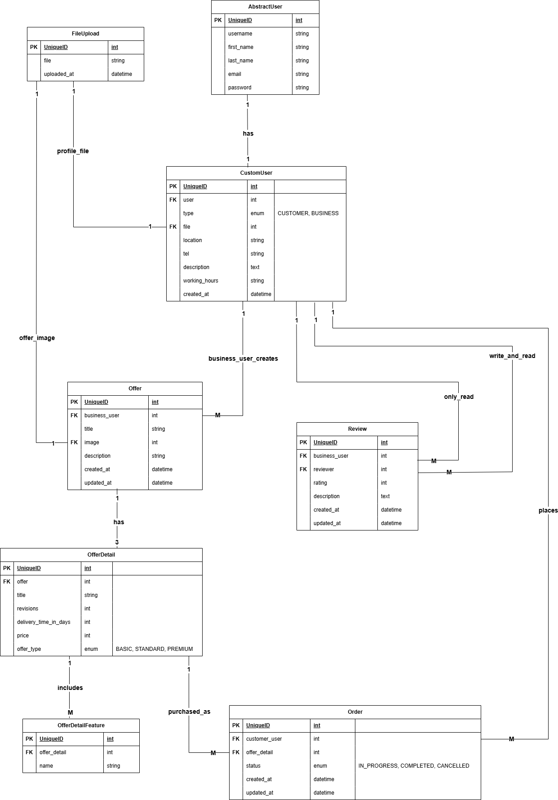
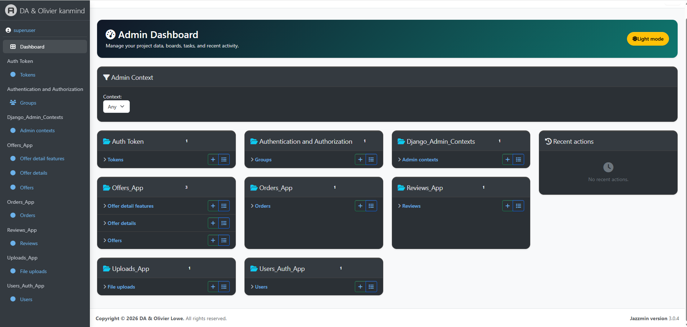
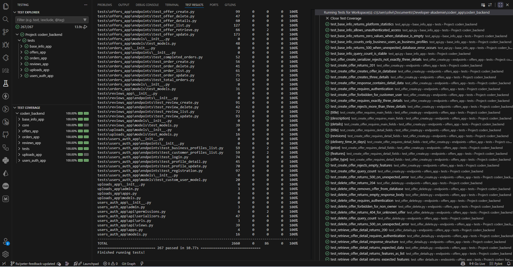

# 🚀 Coderr API


A modern freelance marketplace backend built with Django REST Framework.

Coderr enables customers to purchase services from business users, manage orders, leave reviews, and maintain professional profiles through a clean RESTful API architecture.

---

## 🚀 Features

- 🔐 User registration and authentication
- 👤 Customer and business user profiles
- 📦 Service offers with multiple package tiers
- 📁 File upload support
- 🛒 Order management system
- ⭐ Review and rating system
- 📊 Business user statistics
- 🔍 Public profile discovery
- ⚙️ RESTful API powered by Django REST Framework
- 📖 DRF-spectacular API Documentation
- 🐳 Docker Support

---

## 📦 Setup

### Requirements

- Python 3.12+
- pip / virtualenv
- PostgreSQL 17 (Docker Desktop recommended)
- Pytest + Coverage
- DRF-spectacular API Documentation
- Docker Support
- Optional: Postman

---

### Run Locally with Docker Desktop

Docker Desktop is the recommended way to run the complete application locally.
It starts Django, PostgreSQL, and a one-time migration container. PostgreSQL data
is retained in a named Docker volume when the containers are stopped.

1. Copy the environment template:

```bash
# Linux / macOS
cp .env.template .env

# Windows PowerShell
Copy-Item .env.template .env
```

2. Replace the placeholder values in `.env`. Keep `DB_HOST=db` when Django runs
   through Docker Compose.

3. Build and start the application:

```bash
docker compose up --build -d
```

The database health check runs first, Django migrations run automatically, and
the web service starts only after the migrations succeed.

Open the application at:

```text
http://localhost:8000
```

Useful commands:

```bash
# Show container status
docker compose ps

# Follow application and database logs
docker compose logs -f web db migrate

# Create a Django administrator
docker compose exec web python manage.py createsuperuser

# Run tests (tests use in-memory SQLite)
docker compose exec web pytest

# Stop containers while preserving PostgreSQL data
docker compose down

# Rebuild after dependency or Dockerfile changes
docker compose up --build -d
```

To permanently remove the local PostgreSQL data and start with an empty database:

```bash
docker compose down -v
```

Warning: `docker compose down -v` deletes the local PostgreSQL volume and all data
stored in it. Changing `DB_NAME`, `DB_USER`, or `DB_PASSWORD` after the volume was
created does not update the existing PostgreSQL account automatically.

---

### Local Installation

```bash
git clone https://github.com/Olivierentwicklung/coderr_backend.git

cd coderr-backend

python -m venv .venv

# Linux / macOS
source .venv/bin/activate

# Windows
.venv\Scripts\activate

pip install -r requirements.txt

cp .env.template .env
     - Open the new .env file and replace the placeholders with your actual local secrets.
     - Set DB_HOST=127.0.0.1 when Django runs outside Docker.
     - Ensure PostgreSQL is running and the configured database and user exist.

python manage.py migrate

pytest

python manage.py runserver
```

---

## 🧪 Example Usage

### Open Django Administration

```text
http://127.0.0.1:8000/admin/
```

### Open coderr API Endpoint Dokumentation

```text
http://127.0.0.1:8000/api/schema/swagger-ui/
```

---

## 🔐 Authentication Endpoints

| Method | Endpoint             | Description             |
| ------ | -------------------- | ----------------------- |
| POST   | `/api/registration/` | Register a new user     |
| POST   | `/api/login/`        | Login and receive token |

### Authentication Header

Authenticated requests require:

```http
Authorization: Token <your_token>
```

---

## 👤 Profile Endpoints

| Method | Endpoint                  | Description            |
| ------ | ------------------------- | ---------------------- |
| GET    | `/api/profile/{id}/`      | Retrieve user profile  |
| PATCH  | `/api/profile/{id}/`      | Update user profile    |
| GET    | `/api/profiles/business/` | List business profiles |
| GET    | `/api/profiles/customer/` | List customer profiles |

---

## 📦 Offer Endpoints

| Method | Endpoint                  | Description            |
| ------ | ------------------------- | ---------------------- |
| GET    | `/api/offers/`            | List offers            |
| POST   | `/api/offers/`            | Create offer           |
| GET    | `/api/offers/{id}/`       | Retrieve offer         |
| PATCH  | `/api/offers/{id}/`       | Update offer           |
| DELETE | `/api/offers/{id}/`       | Delete offer           |
| GET    | `/api/offerdetails/{id}/` | Retrieve offer details |

---

## 🛒 Order Endpoints

| Method | Endpoint                                         | Description      |
| ------ | ------------------------------------------------ | ---------------- |
| GET    | `/api/orders/`                                   | List orders      |
| POST   | `/api/orders/`                                   | Create order     |
| PATCH  | `/api/orders/{id}/`                              | Update order     |
| DELETE | `/api/orders/{id}/`                              | Delete order     |
| GET    | `/api/order-count/{business_user_id}/`           | Total orders     |
| GET    | `/api/completed-order-count/{business_user_id}/` | Completed orders |

---

## ⭐ Review Endpoints

| Method | Endpoint             | Description   |
| ------ | -------------------- | ------------- |
| GET    | `/api/reviews/`      | List reviews  |
| POST   | `/api/reviews/`      | Create review |
| PATCH  | `/api/reviews/{id}/` | Update review |
| DELETE | `/api/reviews/{id}/` | Delete review |

---

## Base-info Endpoints

| Method | Endpoint          | Description           |
| ------ | ----------------- | --------------------- |
| GET    | `/api/base-info/` | List base information |

---

## 🧾 Example Requests

### Register User

```json
{
  "username": "exampleUsername",
  "email": "example@mail.de",
  "password": "examplePassword",
  "repeated_password": "examplePassword",
  "type": "customer"
}
```

### Create Review

```json
{
  "business_user": 2,
  "rating": 5,
  "description": "Excellent service and communication."
}
```

---

## 🗂️ Project Structure

```text
coderr_backend/
├── manage.py
├── core/
│   ├── settings.py
│   ├── urls.py
│   ├── asgi.py
│   └── wsgi.py
│
├── base_info_app/
│   ├── api/
│   │    ├── schema
│   │
│   ├── views.py
│   └── urls.py
│
├── users_auth_app/
│   ├── models.py
│   └── api/
│       ├── schema
│       ├── serializers.py
│       ├── views.py
│       ├── urls.py
│       └── permissions.py
│
├── uploads_app/
│   ├── models.py
│
├── offers_app/
│   ├── models.py
│   └── api/
│       ├── schema
│       ├── filters.py
│       ├── pagination.py
│       ├── serializers.py
│       ├── views.py
│       ├── urls.py
│       └── permissions.py
│
├── orders_app/
│   ├── models.py
│   └── api/
│       ├── schema
│       ├── serializers.py
│       ├── views.py
│       ├── urls.py
│       └── permissions.py
│
├── reviews_app/
│   ├── models.py
│   └── api/
│       ├── schema
│       ├── serializers.py
│       ├── views.py
│       ├── urls.py
│       └── permissions.py
│
├── tests/
│   ├── base_info_app/
│   ├── users_auth_app/
│   ├── uploads_app/
│   ├── offers_app/
│   ├── orders_app/
│   └── reviews_app/
│
├── requirements.txt
└── pytest.ini
```

---

## 🧠 ERD Overview

### Core Entities

- CustomUser
- FileUpload
- Offer
- OfferDetail
- OfferDetailFeature
- Order
- Review

### Relationships

```text
Abstract_user 1 ─── 1 CustomUser

CustomUser 1 ─── many Offer
as business_user

Offer 1 ─── 3 OfferDetail

OfferDetail 1 ─── many OfferDetailFeature

CustomUser 1 ─── many Order
as customer

OfferDetail 1 ─── many Order

CustomUser 1 ─── many Review
as reviewer

CustomUser 1 ─── many Review
as reviewed business_user

FileUpload 1 ─── M CustomUser

FileUpload 1 ─── M Offer
```

---

# 🎥 Demo

## ERD



## Django Admin



## API Testing



---

## 🔒 Security

- Token-based authentication
- Protected API endpoints
- Ownership-based permissions
- User role separation
- Serializer validation
- Secure file uploads

---

## 🧑‍💻 Tech Stack

- Python
- Django
- Django REST Framework
- DRF Token Authentication
- PostgreSQL (application runtime)
- SQLite (automated tests only)
- Pytest
- Coverage
- Postman
- DRF-spectacular API Documentation
- Docker Support

---

## ✨ Purpose

Coderr was developed as a freelance marketplace backend project to practice and demonstrate:

- Django REST Framework architecture
- Custom authentication systems
- Relational database design
- RESTful API development
- Business logic implementation
- File upload management
- Testing with Pytest
- Clean project organization
- Real-world marketplace workflows
- DRF-spectacular API Documentation
- Docker Support
